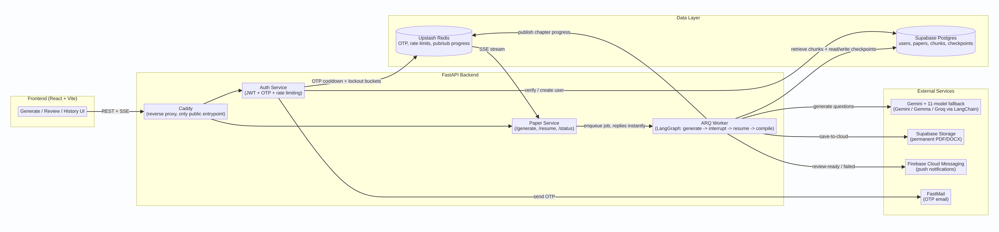
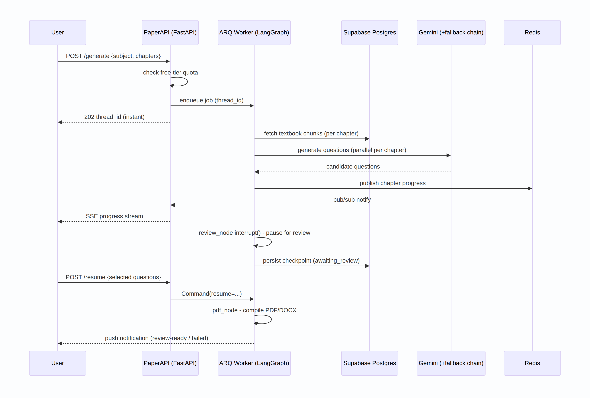

# QuickPaperAI

An agentic RAG system that turns a subject, a standard, and a chapter list into a
reviewed, fully compiled exam paper — question paper and answer key included.

## Overview

QuickPaperAI is built for a tuition teacher's actual workflow: pick a subject, the
chapters to cover, and how many objective/subjective questions per topic. The system
retrieves the real textbook content behind those chapters, generates candidate
questions grounded in it, and hands them back to the teacher for a quick review before
compiling the final paper — a PDF for printing and an editable DOCX for last-minute
changes.

## Problem Statement

Putting together an exam paper by hand means re-reading chapters, hand-picking
questions that match the syllabus and a target difficulty, keeping objective/subjective
counts balanced, formatting mathematical notation correctly, and producing both a
question paper and an answer key — every single time, for every batch and subject.
It doesn't scale past a handful of papers a term. Handing the whole job to a generic
LLM chat isn't a real fix either: without something grounding it in the actual
textbook, there's no guarantee the questions match the syllabus, stay at a sane
difficulty, or render math correctly — and there's no checkpoint before a bad question
ships.

## Solution

QuickPaperAI automates the repetitive parts of paper-setting while keeping the
teacher's judgment as the final checkpoint:

- Textbook content is parsed and chunked ahead of time, so question generation is
  **grounded in the actual chapter text** (RAG), not the model's general knowledge.
- A **LangGraph agent** fans out generation one parallel branch per chapter, calling
  Gemini with an **11-model fallback chain** so one model failing doesn't fail the
  whole batch.
- The graph genuinely **pauses for human review** — a real LangGraph `interrupt()`,
  not a status flag — so the teacher chooses which generated questions make the final
  paper before anything is compiled.
- Generation runs as a **durable background job** (ARQ worker), so the API replies in
  under 50ms instead of holding the request open for however long generation takes.
- The finished paper is **compiled to PDF and DOCX**, with LaTeX/KaTeX-rendered math,
  ready to print or edit further.

## Key Features

- **Curriculum-grounded generation** — questions are retrieved-and-generated from real
  textbook chunks, not free-form LLM guessing.
- **Human-in-the-loop review** — a true pause/resume flow, not a rubber-stamp step.
- **11-model LLM fallback chain** — Gemini, Gemma, and Groq models chained via
  LangChain so a single provider hiccup doesn't fail a chapter.
- **Async by default** — background generation via ARQ with Postgres-backed
  checkpoints, so long-running jobs survive restarts and resume exactly where they
  paused.
- **Live progress** — chapter-by-chapter status streamed to the client over Redis
  Pub/Sub and Server-Sent Events.
- **Push notifications** — Firebase alerts the teacher the moment a paper is ready for
  review, or if generation failed.
- **Free-tier quotas** — new accounts are capped on subjects/chapters so the system
  can't be trivially abused.
- **Hardened auth** — JWT + bcrypt sessions, OTP email verification with cooldowns,
  per-IP rate limiting, and per-account lockout after repeated failed logins.
- **Clean architecture** — storage, document formatting/compilation, and auth are all
  behind interfaces, so adapters (local vs. cloud storage, HTML vs. Markdown
  formatting) can be swapped without touching business logic.

## Architecture

### End-to-end backend

Client, FastAPI backend, data layer, and external services — including where the
free-tier quota, rate limiting, and the LangGraph worker sit relative to everything
else.

### A generation request, end to end

One `POST /generate` traced all the way through: the quota check, the instant reply,
parallel chunk retrieval and question generation, the live progress stream, the real
`interrupt()` pause for human review, and the `resume` that picks the run back up
without starting a new job.
