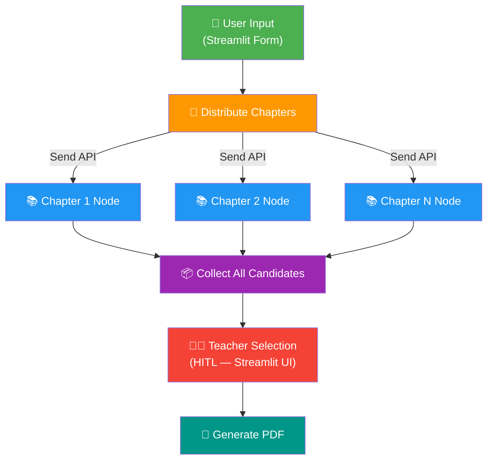
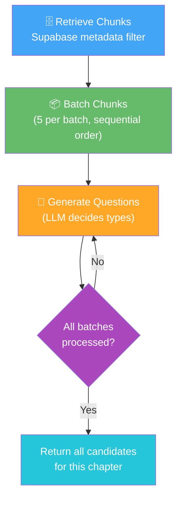

# Question Paper Generator — LangGraph Architecture

## High-Level Flow



---

## Inside Each Chapter Node (Iterative Generation — Approach 2)



Each iteration, the LLM receives:
- **New batch** of 5 chunks
- **Memory** of all previously generated questions (for deduplication)
- **Freedom** to choose the best question type for the content

---

## Node Descriptions

### 1. User Input (Entry Point)
- **Source:** Streamlit form (dropdowns, checkboxes, number inputs)
- **Output:** `PaperRequest` Pydantic model — no NLP parsing needed
- **Fields:** subject, standard, chapters[], difficulty, question counts

### 2. Distribute Chapters (Fan-Out)
- **Uses:** LangGraph `Send` API
- **Action:** Spawns one `Chapter Node` per selected chapter
- **Parallel:** All chapters process simultaneously

### 3. Chapter Node (Per-Chapter Processing)
Runs internally as a loop:

| Step | Action | Details |
|------|--------|---------|
| **Retrieve** | Query Supabase | `WHERE subject=X AND standard=Y AND chapter_name=Z ORDER BY chunk_index` |
| **Batch** | Group chunks | Sequential order, 5 chunks per batch |
| **Generate** | LLM call per batch | Process ALL batches. LLM decides question types. Carries memory of prior questions |

### 4. Collect All Candidates (Fan-In)
- Gathers candidate questions from all chapter nodes
- Groups by question type (MCQ, Short, Long, etc.)
- No LLM consolidation — just aggregation

### 5. Teacher Selection (HITL)
- **UI:** Streamlit page with checkboxes
- Teacher sees all candidates, grouped by chapter & type
- Selects which questions to include in final paper
- Running counter shows: "Selected: 5 MCQ, 3 Short, 2 Long"

### 6. Generate PDF
- Takes selected questions
- Applies format template (based on exam type)
- Uses ReportLab or WeasyPrint
- Outputs downloadable PDF

---

## State Schema

```python
from pydantic import BaseModel
from typing import Literal, Optional
from langgraph.graph import MessagesState

# ── User Input ──
class PaperRequest(BaseModel):
    subject: str
    standard: str
    chapters: list[str]
    difficulty: Literal["Easy", "Balanced", "Hard"]
    question_types: list[str]         # ["MCQ", "Short", "Long", ...]
    counts: dict[str, int]            # {"MCQ": 10, "Short": 5, "Long": 3}

# ── Generated Question ──
class Question(BaseModel):
    question_text: str
    question_type: str                # LLM decides this
    difficulty: Literal["Easy", "Medium", "Hard"]
    blooms_level: str                 # Remember/Understand/Apply/Analyze
    chapter: str
    topic: str
    marks: int
    options: Optional[list[str]]      # MCQ options
    correct_answer: str

# ── Graph State ──
class PaperState(BaseModel):
    request: PaperRequest
    all_candidates: list[Question]    # over-generated pool
    selected_questions: list[Question]  # teacher's picks
    pdf_bytes: Optional[bytes]

# ── Per-Chapter Subgraph State ──
class ChapterState(BaseModel):
    chapter_name: str
    chunks: list[dict]                # retrieved from Supabase
    generated_questions: list[Question]  # accumulated across batches
    current_batch_index: int
```

---

## Data Flow Example

```
Teacher selects: Science, Class 10, Chapters [1, 5], Balanced, 10 MCQ + 5 Short + 3 Long

Step 1 — Fan Out:
  ├→ Chapter 1 Node
  └→ Chapter 5 Node           (parallel via Send API)

Step 2 — Chapter 1 Node:
  Retrieve: 35 chunks from Supabase
  Batch 1 [chunks 0-4]:  → LLM generates 3 MCQ + 1 Short
  Batch 2 [chunks 5-9]:  → LLM generates 2 MCQ + 2 Short  (sees prior 4 questions)
  Batch 3 [chunks 10-14]: → LLM generates 1 Long + 1 MCQ   (sees prior 8 questions)
  ...
  Batch 7 [chunks 30-34]: → LLM generates 2 MCQ + 1 Short  (sees prior 20 questions)
  Total: ~25 candidate questions for Chapter 1

Step 3 — Chapter 5 Node (simultaneously):
  Similar process → ~30 candidate questions for Chapter 5

Step 4 — Collect:
  Total pool: ~55 candidates (25 + 30)

Step 5 — Teacher Selection (Streamlit):
  ☑ MCQ: "What is the role of bile juice?" (Ch1, Easy)
  ☐ MCQ: "Which enzyme breaks down starch?" (Ch1, Easy)  ← teacher skips
  ☑ MCQ: "What is the product of anaerobic respiration?" (Ch5, Medium)
  ...
  Selected: 10 MCQ ✓, 5 Short ✓, 3 Long ✓

Step 6 — PDF:
  Selected questions → formatted template → downloadable PDF
```
